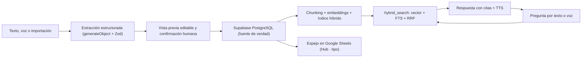

# Arquitectura

## Visión general

## Modelo de datos (tablas principales)

| Tabla | Propósito |
| --- | --- |
| `profiles` | Usuario + rol (`admin`, `editor`, `reader`). El primer registro es admin. |
| `knowledge_types` | Apartados con definición de campos específicos (JSONB `fields`). |
| `knowledge_items` | Contenido unificado: título, resumen, contenido Markdown, `metadata` JSONB validada por tipo, estado, origen del Sheet y posición del espejo. |
| `knowledge_versions` | Snapshot completo en cada guardado; restaurable. |
| `tags`, `item_tags`, `item_relations`, `sources`, `attachments` | Taxonomía, relaciones entre elementos, fuentes citadas y archivos (Storage privado + texto extraído). |
| `chunks` | Fragmentos indexados: `embedding vector(1536)` (HNSW/coseno) + `fts tsvector` (GIN). |
| `conversations`, `messages`, `message_feedback` | Historial de chat privado por usuario + feedback útil/no útil. |
| `sync_jobs` | Trabajos idempotentes de `reindex` y `sheet_mirror`, con reintentos y último error. |
| `audit_logs` | Quién hizo qué y cuándo. |

## Decisiones clave

- **DB como fuente de verdad, Sheets como espejo.** Approaches se siembra desde `docs/Wiki - Approaches .xlsx` (`npm run seed:approaches`). El espejo escribe solo en pestañas `Hub · <tipo>`; las pestañas originales del equipo solo se leen durante importaciones extra. Posición del espejo en `mirror_tab`/`mirror_row`; origen en `source_sheet_*` con checksum para idempotencia.
- **Búsqueda híbrida en SQL.** `hybrid_search` combina ranking vectorial y full-text con Reciprocal Rank Fusion (k=60) y filtra por apartado y `status='published'`. Se ejecuta con el cliente del usuario, así que RLS aplica también al retrieval.
- **Embeddings configurables.** Por defecto Gemini `gemini-embedding-001` recortado a 1536 dims (capa gratuita). OpenAI `text-embedding-3-small` si `AI_PROVIDER=openai`. Si cambias de proveedor o de dimensión, reindexa. Ejecuta `npm run eval:rag` antes/después.
- **Chunking por estructura.** División por encabezados Markdown (~500 tokens máx.), fusión de fragmentos diminutos y partición de secciones enormes por frases. El título del documento y la sección se anteponen al texto al embeber (mejor recall), pero se guarda el texto crudo.
- **La IA propone, la persona dispone.** Toda alta/edición por prompt o voz pasa por `generateObject` con esquema Zod y una vista previa editable; nada se publica sin confirmación humana.
- **Voz por turnos (STT + TTS).** Dictado con `gpt-4o-transcribe` y lectura con `gpt-4o-mini-tts` — más barato y simple que la Realtime API, decisión tomada al planificar.

## Seguridad

- **RLS en todas las tablas**: lectores leen, editores escriben contenido, solo admins gestionan roles, jobs y auditoría. `chunks` solo se escriben con service role (indexador). Conversaciones privadas por usuario.
- **Secretos solo en servidor** (`src/lib/env.ts` importa `server-only`). El navegador solo ve las claves públicas de Supabase.
- **Prompt injection**: el sistema del chat marca el contenido recuperado como datos, no instrucciones; el texto de adjuntos y del Sheet se trata como no confiable.
- **Validación en los límites**: Zod en server actions y route handlers; MIME y tamaño en subidas (15 MB) y audio (20 MB); URLs firmadas (1 h) para adjuntos en bucket privado.
- **Registro sin datos sensibles**: la auditoría guarda acción/entidad/detalle mínimo; el audio de dictado no se persiste.
